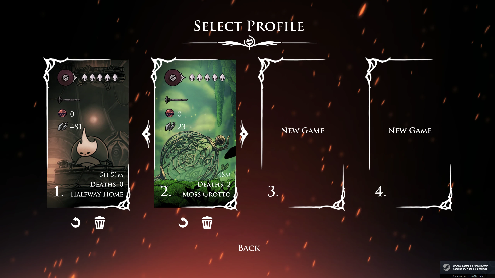
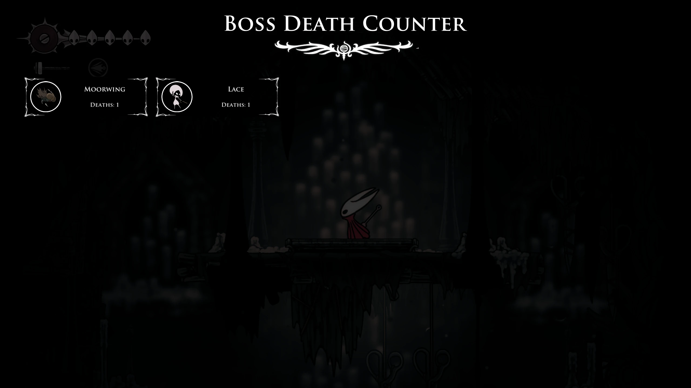

# 💀 Silksong Death Counter

**Version 5.1.0** | **Updated: 17 October 2025**

[](https://www.nexusmods.com/hollowknightsilksong/mods/18)  

A BepInEx plugin for Hollow Knight: Silksong that tracks and displays player deaths. Supports per-save and run-based counters, hotkey reset, automatic config saving, and UI overlay. Provides detailed logging and fallback detection when switching save slots.


## 📖 Overview

Silksong Death Counter is a comprehensive BepInEx mod for Hollow Knight: Silksong that transforms death tracking into a complete statistics system. Track deaths globally, per-save, and per-boss with detailed analytics and beautiful UI integration. Features boss battle detection, sprite integration with the Journal system, and advanced file-based data storage.

Perfect for challenge runs, speedruns, boss practice, or comprehensive gameplay analysis.



## ✨ Features

### 🪦 Advanced Death Tracking

- **Global and per-save death tracking** – each save file maintains independent counters
- **Boss-specific death tracking** – detailed statistics for every boss encounter
- **Run counter system** – track deaths per gameplay session
- **File-based storage system** – robust data persistence outside config files

### 🎮 Rich User Interface

- **On-screen HUD** – persistent death counter in top-left corner
- **Boss Statistics UI** – beautiful overlay showing boss death analytics
- **Unity AssetBundle integration** – professional UI components with proper scaling
- **Journal sprite integration** – boss icons pulled directly from game's Journal system
- **Toggle visibility (F8)** – hide/show the death counter at will

### 🐉 Boss Battle System

- **Automatic boss detection** – recognizes boss fights in real-time
- **Boss metadata tracking** – stores Journal names, display names, and sprite references
- **Death-on-boss analytics** – know exactly which bosses cause the most trouble
- **Boss fight state management** – tracks when battles start and end

### 🛠️ Configuration & Controls

- **F8** – Toggle death counter visibility
- **F10** – Reset run death counter
- **Fully configurable** – position, font size, visibility settings
- **Save slot detection** – automatic profile switching support



## 📦 Installation

### ⚠️ Official Distribution

**This mod is ONLY officially distributed through Nexus Mods.**  
Do not download from any other source. Unofficial mirrors or re-uploads are unauthorized.

### Download

**[⬇️ Official Download - Nexus Mods](https://www.nexusmods.com/hollowknightsilksong/mods/18?tab=files)**

### Steps

1. Install **BepInEx 5** (latest stable) for your game version
2. Extract BepInEx into your Silksong installation directory
3. After running the game once, a `plugins` folder will be created
4. Download the mod archive from Nexus Mods
5. Inside you will find a folder:
   ```
   SilksongDeathCounter/
   ├── SilksongDeathCounter.dll
   └── ui_bundle
   ```
6. Copy the **SilksongDeathCounter** folder into: `<GameFolder>/BepInEx/plugins/`
7. Launch the game

### Installation Structure

```
Hollow Knight Silksong/
├── BepInEx/
│   └── plugins/
│       └── SilksongDeathCounter/
│           ├── SilksongDeathCounter.dll
│           └── ui_bundle
```

## 🎮 Usage

### Death Counter HUD

- Displays automatically in top-left corner
- Format: `Deaths: <total> (Run: <run>)`
- Press **F8** to toggle visibility

### Boss Statistics

- Beautiful overlay with boss death analytics
- Shows boss sprites from Journal system
- Displays death count per boss
- Scroll through your boss death history

### Hotkeys

- **F8** – Toggle death counter visibility
- **F10** – Reset run counter

## 💾 Data Storage

Death counts stored in:

```
<GameFolder>/BepInEx/plugins/SilksongDeathCounter/DeathCounterData/
```

File structure:

- **Separate files per save slot:** `Save_1_Deaths.txt`, `Save_2_Deaths.txt`, etc.
- **Boss data:** `BossDeaths/Boss_<name>_Save_<slot>.json`

⚙️ **You can manually edit values for each boss** in the `DeathCounterData` directory.

## ⚙️ Configuration

After first launch, the mod creates a config file:

`BepInEx/config/com.peacestudio.silksongdeathcounter.cfg`

### Available Settings:

```ini
[Hotkeys]
ResetRunDeaths = F10        # Reset run counter
ToggleCounter = F8          # Toggle counter visibility

[UI]
XPosition = 12              # Horizontal screen offset
YPosition = 12              # Vertical screen offset
FontSize = 16               # Death counter font size
CounterVisible = true       # Counter visibility state
```

## 🎮 Tracked Bosses

Tracks all major bosses including:

- Moss Mother
- Bell Beast
- Lace (both encounters)
- Fourth Chorus
- Savage Beastfly
- Sister Splinter
- Skull Tyrant
- Moorwing (Vampire Gnat)
- Conchfly & Great Conchfly
- Phantom
- Last Judge
- Cogwork Dancers & Clover Dancers
- Trobbio & Tormented Trobbio
- Forebrothers (Signis & Gron)
- Disgraced Chef Lugoli
- Father of the Flame
- Groal the Great
- Voltvyrm
- First Sinner
- Broodmother
- Crawfather
- Second Sentinel
- Widow
- Gurr the Outcast
- Summoned Saviour
- Palestag
- Watcher at the Edge
- Nyleth
- Skarrsinger Karmelita
- Crust King Khann
- Bell Eater
- Plasmified Zango
- Pinstress
- Shrine Guardian Seth
- The Unravelled
- Grand Mother Silk
- Lost Lace

## 🏗️ Architecture

### Core Components

1. **DeathCounterPlugin.cs** - Main plugin entry point

   - Initializes all systems
   - Manages Harmony patching
   - Coordinates update cycles

2. **DeathTracker.cs** - Death counting and boss tracking

   - Tracks total deaths per save
   - Run death counter
   - Boss fight state management
   - File-based data persistence

3. **BossStatsUI.cs** - Boss statistics UI system

   - AssetBundle loading and management
   - Boss sprite integration from Journal
   - Beautiful UI overlay with boss analytics
   - Pause menu integration

4. **SaveManager.cs** - Save slot management

   - Detects save slot changes
   - Loads/saves data for each save independently
   - Profile switching support

5. **UIManager.cs** - HUD overlay management

   - On-screen death counter display
   - Font management (Trajan Pro Bold)
   - Position and visibility control

6. **ConfigManager.cs** - Configuration management

   - Settings from `.cfg` file
   - Hotkey bindings
   - UI position and font size

7. **Patcher.cs** - Harmony patches
   - Patches player death methods
   - Detects boss fight start/end
   - Pause menu button integration

## 🛠️ For Developers

### Building from Source

**Requirements:**

- Visual Studio 2019 or newer
- .NET Framework 4.7.2 or higher
- BepInEx 5.x reference assemblies
- Hollow Knight: Silksong game assemblies

### API Integration

The mod provides public getters for integration with other mods:

```csharp
// Get total deaths for current save
int totalDeaths = DeathTracker.GetTotalDeaths();

// Get run deaths
int runDeaths = DeathTracker.GetRunDeaths();
```

## 📝 License

This mod is provided as-is for the Hollow Knight: Silksong community.

## 🙏 Credits

- **Team Cherry** for creating Hollow Knight: Silksong
- **BepInEx Team** for the modding framework
- **Harmony** for runtime patching capabilities

## 📞 Support

For bug reports, feature requests, or questions:

- Check the [Nexus Mods page](https://www.nexusmods.com/hollowknightsilksong/mods/...)
- Report issues on GitHub
- Join the Hollow Knight modding community

---

**Version:** 5.1.0  
**Last Updated:** October 17, 2025  
**Created by:** Rexxah  
**Uploaded by:** [Rexxah @ Nexus Mods](https://www.nexusmods.com/hollowknightsilksong/users/54723662)  
**Original Upload:** September 5, 2025

**Statistics:**

- 📥 Total Downloads: **16,404**
- 👥 Unique Downloads: **13,787**
- 👁️ Total Views: **50,909**
- 👍 Endorsements: **236**

- .NET Framework 4.7.2 lub wyższy
- Biblioteki z gry (w folderze `libs/`):
  - `Assembly-CSharp.dll`
  - `UnityEngine.dll`
  - `UnityEngine.UI.dll`
  - `UnityEngine.CoreModule.dll`
- BepInEx biblioteki:
  - `0Harmony.dll`
  - `BepInEx.dll`

**Kroki:**

1. Sklonuj repozytorium
2. Otwórz `SilksongDeathCounter.sln` w Visual Studio
3. Upewnij się, że referencje do DLL są prawidłowe
4. Skompiluj projekt (Build > Build Solution)
5. Wynikowy `SilksongDeathCounter.dll` znajdzie się w `bin/Debug/` lub `bin/Release/`

### Struktura kodu

```
SilksongDeathCounter/
├── DeathCounterPlugin.cs      # Główna klasa moda (BepInEx plugin)
├── DeathTracker.cs             # Logika śledzenia śmierci
├── UIManager.cs                # Zarządzanie UI licznika
├── BossStatsUI.cs              # UI statystyk bossów
├── SaveManager.cs              # Zarządzanie zapisami
├── Patcher.cs                  # Harmony patches
├── ConfigManager.cs            # Konfiguracja
## 🔧 How It Works

Uses **Harmony** to patch game code at runtime:

- **DeathTracker** - Detects player deaths and boss fights via `TakeDamage` patches
- **UIManager** - Renders on-screen overlay with death counts
- **BossStatsUI** - Loads Unity AssetBundle for boss statistics panel
- **SaveManager** - Handles per-save data loading/saving
- **Patcher** - Applies Harmony patches and integrates pause menu button## 🛠️ Building from Source

**Requirements:**
- Visual Studio 2019+
- .NET Framework 4.7.2+
- Game libraries: `Assembly-CSharp.dll`, Unity engine DLLs
- BepInEx libraries: `0Harmony.dll`, `BepInEx.dll`

**Steps:**
1. Clone repository
2. Open `SilksongDeathCounter.sln`
3. Ensure DLL references are correct
4. Build solution
5. Output: `bin/Release/SilksongDeathCounter.dll`## 💡 Tips

- First playthrough? Keep the counter visible to track your progress
- Challenge runs? Monitor boss death counts to improve strategies
- Each save slot tracks independently - try different playstyles!

## 🤝 Support

Check `BepInEx/LogOutput.log` for errors. Ensure `ui_bundle` is in the plugins folder and BepInEx 5.x is properly installed.

## 📜 License & Distribution

**Proprietary License - All Rights Reserved**

- ✅ Source code is available for **viewing and educational purposes only**
- ❌ **Redistribution, re-uploading, or mirroring is PROHIBITED**
- ❌ **Commercial use is PROHIBITED**
- ❌ **Publishing on other platforms is PROHIBITED**
- 🔒 **Official distribution ONLY through [Nexus Mods](https://www.nexusmods.com/hollowknightsilksong/mods/18)**
- 📧 **Author permission required** for any use beyond personal gameplay

See [LICENSE.md](LICENSE.md) for full terms.

### ⚠️ Important Notice

This mod may ONLY be distributed through its official Nexus Mods page. Any other distribution, including:
- Re-uploading to other mod sites
- Including in mod packs without permission
- Mirroring on file hosting services
- Commercial distribution

**...is strictly prohibited and violates the license terms.**

## 🙏 Credits

**Author:** Rexxah (PeaceStudio)
**Official Page:** [Nexus Mods](https://www.nexusmods.com/hollowknightsilksong/mods/18)
**Contact:** [Nexus Mods Profile](https://www.nexusmods.com/hollowknightsilksong/users/54723662)

**Special Thanks:**
- **Team Cherry** - for creating Hollow Knight: Silksong
- **BepInEx Team** - for the modding framework
- **HarmonyX** - for runtime patching

---

**Version:** 5.1.0
**Last Updated:** October 17, 2025
**License:** Proprietary - All Rights Reserved
**Official Distribution:** Nexus Mods Only

*Hollow Knight: Silksong © Team Cherry*
*This mod is not affiliated with or endorsed by Team Cherry*
```
